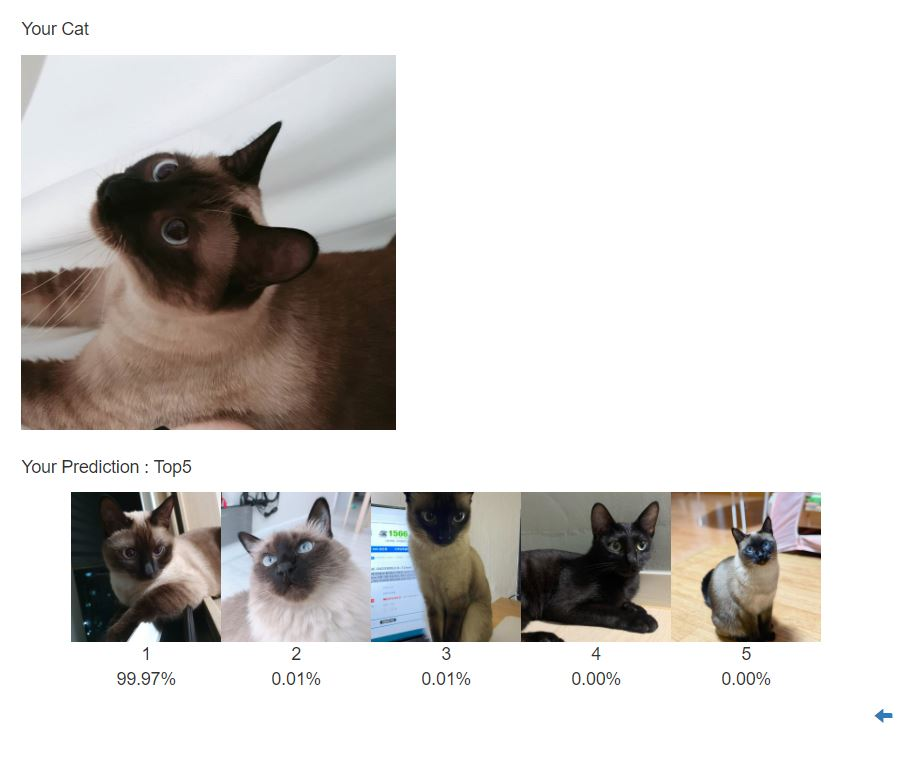

# CS470-Team-25

Requirements
=====
To install Requirements, use

`$ pip3 install -r requirements.txt`

The model is written and tested on cuda enviroment

Also, you have to download `ckpt.pt` from below link and place into `./cat_id/flask_deep/`
https://drive.google.com/file/d/1pcQRjzuhWySDOAnumXhN16y5s9jBK1Ni/view?usp=sharing


Experiment
=====
To launch demos, move to `cat_id` directory and execute

`$ python3 server.py`

Then you can access to the demo by move to the address in your browser,

`127.0.0.1:5000`

This is the result page you will see after uploading a cat image.


File Structure
=====
```
.
|-- data_collect
|   |-- crawling.py
|   |-- rename.py
|-- cat_id
|   |-- server.py
|   |-- flask_deep
|       |-- static
|       |   |-- css
|       |-- templates
|       |   |-- result.html
|       |   |-- upload.html
|       |-- init.py
|       |-- Classifier.py
|-- Classifier.py
|-- resave.py
|-- test_model.py
|-- 대표이미지
|-- cropped_cat
|-- cropped_cat_2
```

`Classifier.py`
----
The main Function that preprocess and train model

`resave.py`
---
Utility script to reduce the size of the checkpoint file

`test_model.py`
----
Plot train/valid accuracy/loss and show some examples

`./cat_id`
----
Directory that include service frontend/backend
 - `./server.py`
     Run the server
 
 - `./flask_deep/__init__.py`
    Script that execute server

`./data_collect`
----
Directory that include crawler & dataset
 - `rename.py`
    Utility function to reorganize file structure
    


`./cropped_cat`
----
Trials to crop the cat face using the pretrained model of [pycatfd](https://github.com/marando/pycatfd)

`./cropped_cat2`
----
Trials to crop the cat face using the pretrained model of [Haar Cascade Model in OpenCV](https://github.com/opencv/opencv/blob/ca9756f6a1ea25a232d83d768f833b4fa3ee4cf4/data/haarcascades/haarcascade_frontalcatface_extended.xml)
